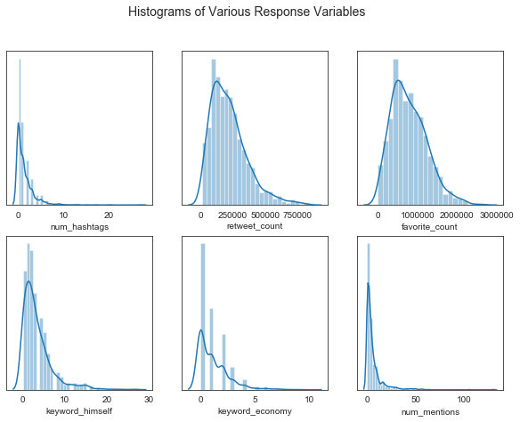
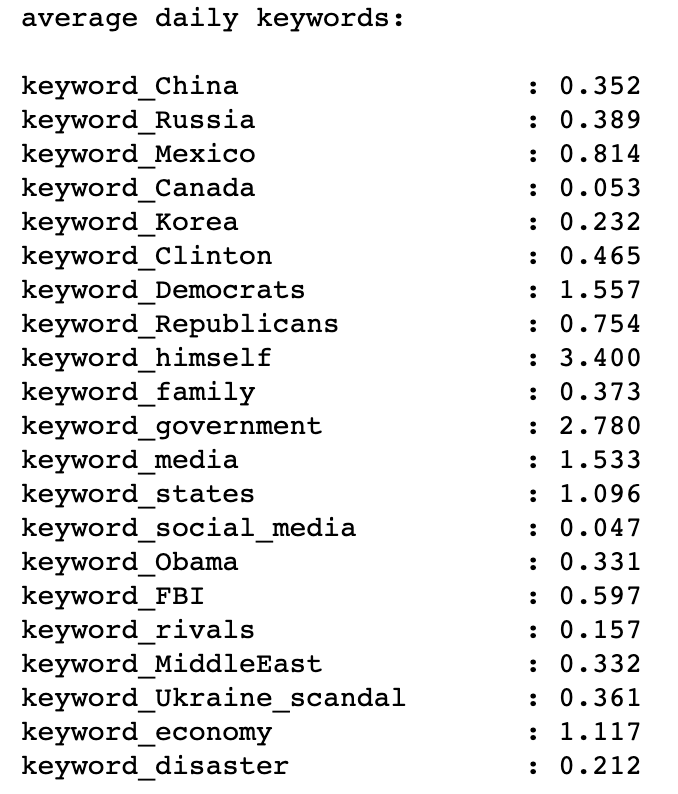
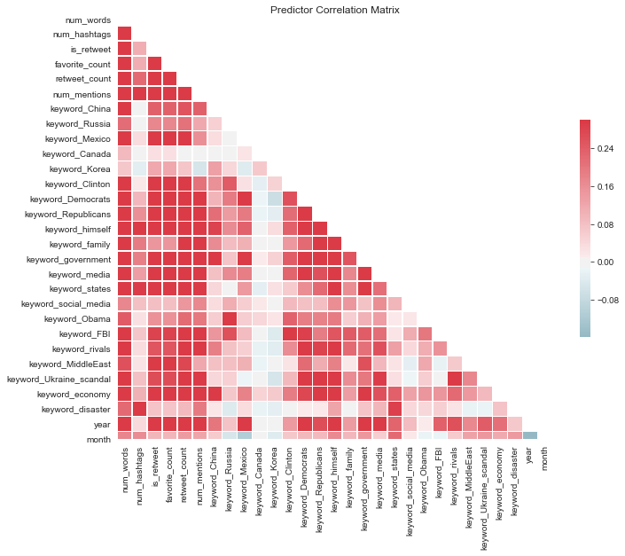

---
title: Data 
layout: default
filename: data.md
--- 

## Data:

### Tweets: 

Tweets were downloaded from the [Trump Twitter Archive](http://www.trumptwitterarchive.com/archive) and analyzed using the Jupyter notebook `tweets/parse_tweets.ipynb`. 
Only tweets between January 20th, 2017 and October 30th, 2019 were selected, which led to 11,717 entries. 

#### Simple Tweet Predictors:

Most metadata were collected automatically through the Trump Twitter Archive, but some (`num_mentions`, `num_retweets`) had to be collected in Python. 
The tweet text was then sanitized for downstream analysis by removing Twitter-specific marks (e.g. “@”, “#” to denote mentions and hashtags, respectively) and HTML entities (“\&amp;”). 
The tweets were then split into words using the Python library `nltk` (using a pretrained model), and parts of speech were assigned.

*Figure 1*: Histograms of tweet metadata and selected descriptors.

Initial topic analysis was done using human-defined lists of keywords: for instance, a tweet containing the word “Moscow”, “Putin”, or “Russian” would be flagged as `keyword_Russia`. 
Using this method, we found that approximately 70% of tweets could be assigned with at least one keyword (Figures 1, 2). 
This strategy, although crude, allowed us to develop baseline models to compare against more refined predictor sets, 
and also serves as a useful reality check to use in combination with automated topic extraction. 
The current keywords show a relatively small degree of multicollinearity, which indicates that the user-defined topics can serve as a passable predictor set (Figure 3).

*Figure 2*: Manually assigned keywords, summed by day. 

*Figure 3*: Correlation matrix for keyword and metadata predictors.

