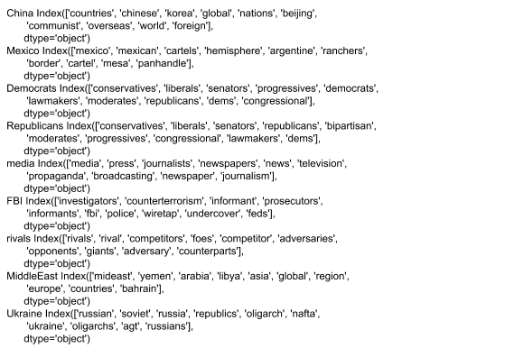
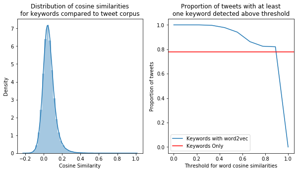
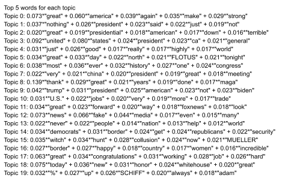
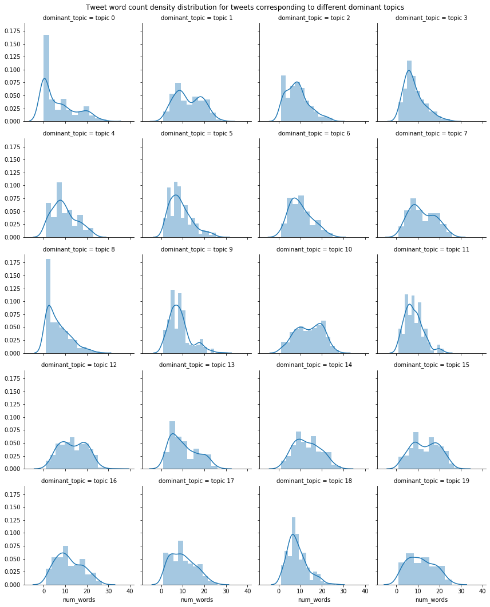
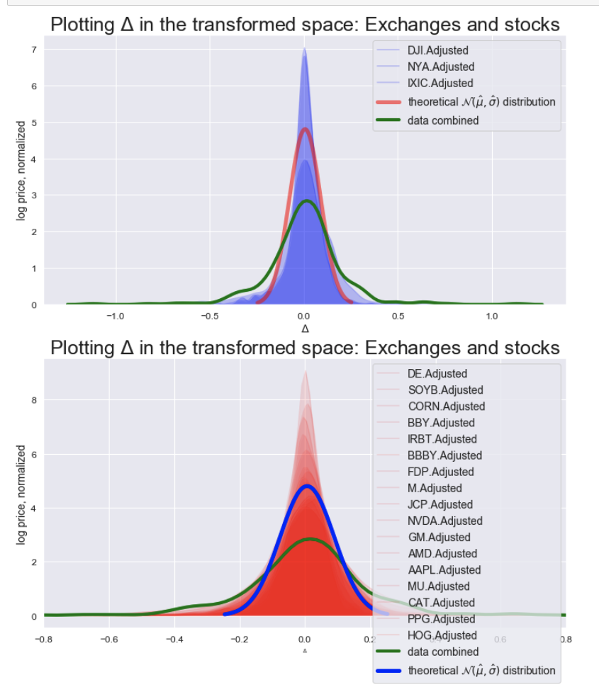
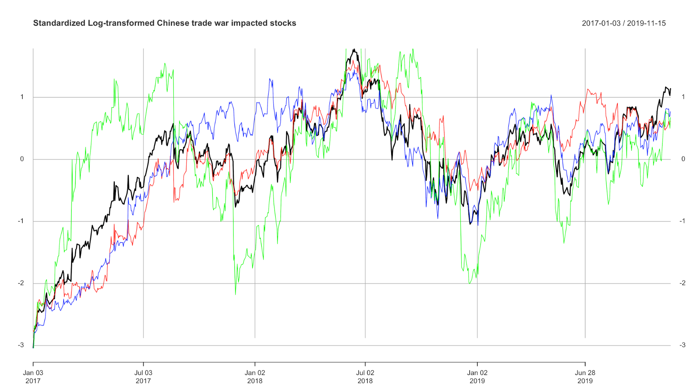
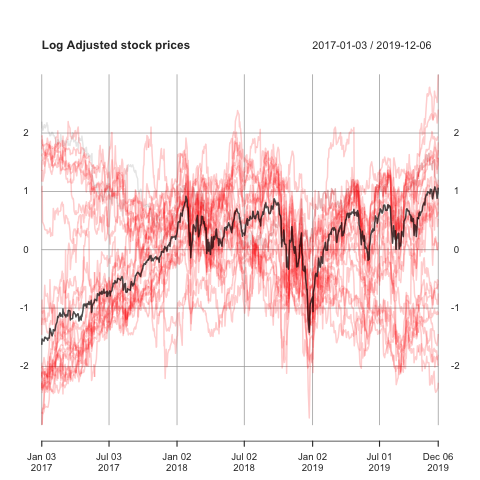
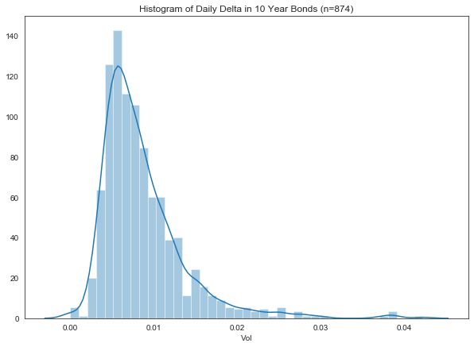
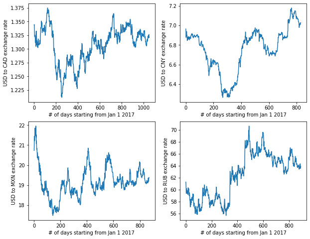

---
title: Data 
layout: default
filename: data.md
--- 

#### Tweets: 
Tweets were downloaded from the [Trump Twitter Archive](http://www.trumptwitterarchive.com/archive) and analyzed using the Jupyter notebook `tweets/parse_tweets.ipynb`. 
Only tweets between January 20th, 2017 and October 30th, 2019 were selected, which led to 11,717 entries. 

##### Simple Tweet Predictors:

Most metadata were collected automatically through the Trump Twitter Archive, but some (`num_mentions`, `num_retweets`) had to be collected in Python. 
The tweet text was then sanitized for downstream analysis by removing Twitter-specific marks (e.g. “@”, “#” to denote mentions and hashtags, respectively) and HTML entities (`&amp;`). 
The tweets were then split into words using the Python library `nltk` (using a pretrained model), and parts of speech were assigned.

**Figure 1**: Histograms of tweet metadata and selected descriptors.

Initial topic analysis was done using human-defined lists of keywords: for instance, a tweet containing the word “Moscow”, “Putin”, or “Russian” would be flagged as `keyword_Russia`. 
Using this method, we found that approximately 70% of tweets could be assigned with at least one keyword (Figures 1, 2). 
This strategy, although crude, allowed us to develop baseline models to compare against more refined predictor sets, 
and also serves as a useful reality check to use in combination with automated topic extraction. 
The current keywords show a relatively small degree of multicollinearity, which indicates that the user-defined topics can serve as a passable predictor set (Figure 3).

{:height="450px"}

**Figure 2**: Manually assigned keywords, summed by day. 

**Figure 3**: Correlation matrix for keyword and metadata predictors.

##### Natural Language Modelling of Tweets:

As Twitter text is informal and limited in the number of characters, it lends itself to usage of many, and likely rapidly changing, abbreviations and societal references. 
Many such abbreviations, if we can pick them out, could be quite useful in building a keyword search. 
However, this also means that the number of keywords for a particular topic could potentially become arbitrarily large and hard to cull by hand. 
This motivates the use of two different types of models: 
(1) topic models, which aim to find groups of words that form recurring ‘topics’ in the particular set of tweets, as well as 
(2) word embeddings, which assume that high-dimensional word space can be projected onto a lower-dimensional manifold, such that related words lie close to one another in lower-dimensional space.

###### Word Embeddings:

As previously discussed, using keywords informed by domain knowledge will likely be helpful for our prediction task; 
however, it might not be feasible to come up with an exhaustive list of all keywords that might be used in any text. 
Therefore, we are investigating the use of word embeddings (*vide supra*). 
In particular, we are using Google’s pre-trained `word2vec` skipgram embedding, which transforms each word into a vector of length 300.

Our first investigations involved comparing the `word2vec` embedding with the previously established keywords. 
Every valid word in the Trump tweets was compared to every aforementioned keyword using cosine similarity; 
the top 10 most similar words in the tweets for some exemplar keywords are shown in Figure 4. 
Using this metric, we can now take advantage of a larger breadth of vocabulary, while still using our domain knowledge. 
Notably, only a small proportion of tweet word space has a cosine similarity of  >0.5 (Figure 5), which suggests that this method might not trade sensitivity for significant reductions in specificity.
Admittedly, this particular embedding, while extensive, was produced in 2013; certain contemporary political figures, events, and other references might not be appropriately represented in this model.
Additionally, social media-specific terms including hashtags and emojis will not be captured by the pre-trained embeddings. 
Looking forward, we will likely augment the word embeddings with rationally chosen subsets of keywords that do not appear in the pretrained `word2vec` model; 
with more time, it might be advantageous to train a skipgram on a large corpus of tweets and use updated embeddings.

**Figure 4**: Top 10 keyword associations with words found in tweets based on embeddings from `word2vec` skipgram model.

**Figure 5**: Distribution of cosine similarities between each keywords and each word in tweets (left) and proportion of tweets with cosine similarity between a keyword and a word in the tweet such that the similarity is above a particular threshold (i.e., the tweet is “activated” by at least one keyword) (right).

###### Topic Modelling:

To further explore recurrent themes in the tweets, we investigated collections of words in the tweets with [topic modeling](http://www.jmlr.org/papers/volume3/blei03a/blei03a.pdf). 
Briefly, a topic model models a document as a distribution over topics, and models a topic as a distribution over words, enabling investigation of recurrent patterns of words in multiple documents. 
The model employs a Latent Dirichlet Allocation algorithm, which is a matrix factorization approach to solving for the most likely Document-Topic and Topic-Word assignment matrices. 
This model is implemented in the Python `gensim` library.

We performed topic modeling on the text in the tweets, and aim to use topic information to help improve model predictions. 
First, we modeled all the text in the tweets, including stop words, prepositions, and “to be” verbs. 
Many of the resultant topics (not shown) were collections of prepositions and “to be” verbs, so a second model was built after removing these tokens. 
A model with 20 topics and the top 5 words that contribute to the particular topic are shown in Figure 6. 
Each tweet was then scored by topic, and tweets were grouped by “dominant topic” (i.e. the topic with the highest likelihood of being associated to the tweet). 
Next, we asked whether different topics were represented in substantially different types of tweets. 
Considering only the tweet length (number of words), topics whose most likely/explanatory word had a high coefficient tended to have a smaller number of words per tweet (e.g. topic 0) 
than those whose most likely word had a low coefficient (e.g. topic 16) (Figure 7). 
This makes sense, because some small groups of words, like “great”, “america”, “again”, and “make”, actually comprise a slogan/idea--topic 0 is “Make America Great Again”. 
However, other more complex topics have a more even distribution over words.

We intend in the next model iteration(s) to use these topic modeling results, either by directly scoring tweets or by using the topics to expand our keyword approach. 
A clear limitation of the topic model is highlighted in the previous subsection on word embeddings: 
the basic topic model has no way of capitalizing on synonymous words that might appear equally frequently in the same topics. 
To address this, we will investigate a model that combines topic modeling with word embedding (an [Embedded Topic Model](https://arxiv.org/pdf/1907.04907.pdf)).

**Figure 6**: The top 5 contributing words to each of 20 topics in the topic model without stop words, prepositions, and “to be” verbs. Some of the topics are parts of or entire coherent ideas.

**Figure 7**: Tweet word count for tweets classified as each of 20 different dominant topics

##### Sentiment Analysis: 

Using 

#### Stocks:

Stock data was downloaded and compiled using the `BatchGetSymbols` and `Quantmod` packages in R. 
We put together a simple response variable that was an average of the following stocks after a transformation: BZUN, BABA, MOMO, PDD. 
The Chinese stocks were selected from [this article](https://www.investors.com/market-trend/stock-market-today/stock-market-rips-higher-trade-optimism-chinese-stocks-make-big-moves/). The American trade war sensitive stocks were selected because of [this article](https://www.cbsnews.com/news/us-china-tariffs-5-american-industries-hit-hardest-by-president-trumps-u-s-china-trade-war/
), and [this article](https://www.kiplinger.com/slideshow/investing/T052-S001-14-stocks-already-hurt-by-president-trump-tariffs/index.html).

Here are the stocks we selected by category, all of which were selected because they are supposedly highly correlated with the trade war.

 Chinese stocks:
 Bazun (BZUN), Alibaba (BABA), MOMO, Pinduoduo (PDD).
 
 American superconductor, robotics, and technology stocks:
 Nvidia (NVDA), Micron (MU), AMD, Irobot (IRBT), apple (APPL)
 
 American Farm stocks:
 CORN (literally a corn commodity etf), SOYB (a soybean EFT), Fresh Delmonte Produce (FDP)
 
 American Retail:
 Best Buy (BBY), Bed Bath and Beyond (BBBY), Macy's (M), JC Penny (JCP),
 
 American industrials, agricultural vehicles and manufacturing
 
 General Motors (GM), Deere  [DE] (https://www.deere.com/en/index.html),  Caterpillar Inc. (CAT), PPG Industries (PPG, they are a construction paint company), Hog Global Shipping  (HOG)

We then downloaded the averages of the NYSE (NYA), the NASDAQ (IXIC) and the DOW JONES (DJI). We took a weighted average of the 31 stocks and the 3 exchanges: 0.5* (mean of the trade war sensitive stocks) + 0.5* (the mean of the tree exchanges). We averaged our trade-war sensitive stock average with the exchange data in order to revert our response variable a bit towards the mean, in an attempt to avoid overfitting on the particular stocks we selected. This is analygous to the way a mixed-effects model reverts cluster level means towards the global means. Our model response variable is still trade war sensitive, but probably more robust than it would have been had we not taken the above step. In the plot below you can see the aggregations of the stock and exchange data, (the red and blue areas under the curve) as well as the output of the weighted average (in green). We have a normal-ish distribution for these data in the log-space (though with a lower peak and fatter tails), which means our response should be somewhat easy to model. Since we are using Nueral nets, it wasn't essential to have a perfect normal distribution for our response.

{:width="800px"}

However, it's important to note that we did this after transforming and normalizing our data.

We assumed that the stocks were log-normally distributed as is assumed by the Black-Sholes equation. 
It is useful, as is taught as the standard in STAT 123 because the support is non-negative and is right skewed. 
We took the log of stock prices, and then averaged the resulting standardized normal normal data to produce a response variable. 
That is shown below (Figure 8) where the line in black is the average of the stocks. 
This linear combination makes sense because a linear combination of normal random variables is also normal.

Here are two sub-examples: only our Chinese Stocks:

{:width="800px"}

Only our American Stocks:

{:width="800px"}

**Figure 8**: Aggregate Chinese stock data

#### Bonds:

We downloaded US bond data for varying time cycles directly from Yahoo Finance. 
The resulting data (which had many missing values) was imported in R and cleaned using `na.approx` from the `zoo` package.
This was done in RMD but we plan to convert the scripts to Python code for the next stage of the project.
We will also train on a new response variable: 
the yield curve (which we will calculate as the difference between the 10 year and two year US bond interest rates and is seen as presaging recession).

To arrive at a rough measure of volatility, we took the difference between the highest and lowest value each day (for 10 year US Treasury bonds) (Figure 9).

**Figure 9**: Daily delta for 10 year US Treasury bonds.

#### Other:

In addition to stocks and bonds, we will also investigate the effect of the tweets on other potentially relevant economic responses: 
gold, oil, bitcoin, and the foreign exchange rates of the US dollar against the currencies of Canada, China, Mexico, and Russia (Figure 10).

**Figure 10**: Foreign exchange rates.

