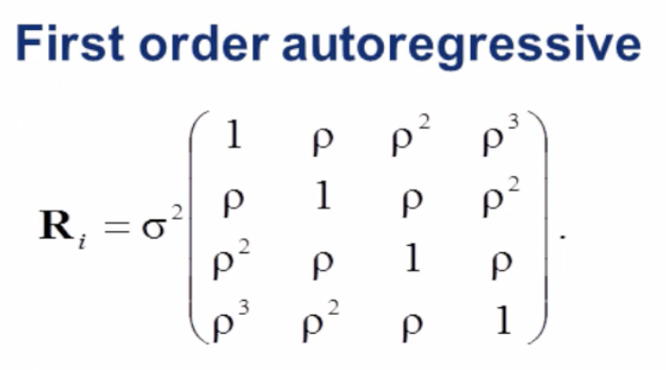

---
title: Future Work 
layout: default
filename: future_work.md
--- 

#### Future Work:

Although the initial results are promising, there is much that could be done to improve the quality of these data and strengthen the conclusions.  
Presented on this page are just a few of the many ideas we've considered over the course of this project. 

##### Better and More Random Stock Selection

We could take an average of more stocks (both a simple random sample and a sample of stocks that are particularly vulnerable to the trade war). 
We could also weight stocks by how much total money is being traded per stock, which might better reflect the actual state of the market.

##### Better Data Augmentation:

As mentioned previously ([*vide supra*](models.md)), applying purely numerical data augmentation to the final predictor set had a profound effect on model quality. 
Due to time, we were unable to experiment with more sophisticated ways to augment the data, but there is almost certainly a more effective way than simply adding a random variable!

One approach would be to augment Trump's corpus of tweets by using synonyms to generate new Trump-like tweets, and replacing the original tweet with these synonym-containing tweets.
These new tweets would likely have similar, but distinct, `word2vec` encodings and topic embeddings, and could be used to train a more robust model. 

Another approach would be to train models on subsets of the tweets from each day: instead of combining all the tweets from every day into a single combined variable, 
tweets could be sampled with replacement to generate many distinct rows of data from each day. 

##### More Sophisticated Sentiment Analysis:

The current method uses only a single number to convey how positive/negative Trump's tweets are. However, more sophisticated sentiment models 
(which break text into many constituent emotions) are possible, and could be used to glean additional insights from each tweet. 

##### Transfer Learning: 

Given the small dataset available here, it is difficult to train complex multi-layer neural nets without overfitting. 
Using a model that had been pre-trained on tweets from other world leaders (e.g. Vladimir Putin, Boris Johnson, Mike Pence) 
might quicken optimization and permit more complex model architectures to be employed. 

##### Moving Averages to Model Volatility:

 In this study we have employed moving averages, but we haven't optimized the length of our moving average. 
 Given that Trump tweets so often, our prior belief was that his tweets would principally affect intraday prices or next-day prices---in
 other words, the model's response variable implicitly assumes a short memory for tweets.  
 This assumption has not been empirically tested, and it is possible that differences in moving averages for price would work better than our current response variable (by helping to reduce noise). 
 Optimizing the number of days over which to take a moving average might prove to be an important hyperparameter. 
 
 We used the moving average [movavg](https://www.rdocumentation.org/packages/pracma/versions/1.9.9/topics/movavg) function in R to produce the following plots of changing values over *n* days:
 

**Figure 1**: Moving Average of Apple (AAPL)

 
**Figure 2**: Moving Average of Corn Prices (CORN)

**Figure 3**: Moving Average of Alibaba (BABA)
  

**Figure 4**: Moving Average of Dow Jones Index (DJI)
 
Because we used the exponential moving average call in R which is 
"a weighted moving average that reduces influences by applying more weight to recent data points",
the end result is similar to auto-regression (*vide infra*).
 
##### Auto-Regression to Model Volatility:
Autoregression uses previous time steps to predict values at the next time steps.
Below is a [graphic](https://www.youtube.com/watch?v=0kaxO0r7PYs) of a first order autoregressive covariance matrix: each observation is most correlated to the observation it is closest to in time
(Figure 5).

{:width="200px"}

**Figure 5**: Auto-regressive covariance matrix

Similarly to moving averages, this might provide a more accurate response variable with which to extract volatility from the market, which in turn might lead to a more informative model.

##### Volume information and Momentum:
This model only examines volatility as a function of price: a more sophisticated model might also include the volume of stocks traded by day.
Given the log-normal assumptions employed and justifications for our response transformations, we opted to use a simple interday difference to get normal looking histograms for our response variable
([*vide supra*](data.md)).
However, more statistically complex methods of modelling volatility might produce more accurate results.
 
If given more time, we would like to add a momentum term to the model (specifically to the aforementioned coefficient of volume).  
We envisioned adding this term analogously to the definition of momentum in classical mechanics (*p* = *mv*). 
There woudl be two hyperparameters associated with a momentum term: 
the power to which volume would be raised and a learning coefficient that determines the relative weight of the term. 
Optimization in such a system might prove challenging, however. 

##### Multiple Stock Response Variables:
Instead of combining stocks into "American" and "Chinese", we could split the response variables more finely: for example, we could consider only farm stocks or only superconductor stocks.
However, the probabilities of these multiple response variables might be linked in complex joint distributions, which would require more advanced statistical techniques to treat fully. 

##### More Sophisticated Models:

Due to the small size of the dataset in this study, we opted to employ a simple 3-layer dense neural network. 
However, it is likely that more complex neural network architectures (e.g. recurrent neural networks) might prove better-suited to the task at hand. 
Advances in data augmentation or transfer learning might allow for such advances to be applied here in the future.
