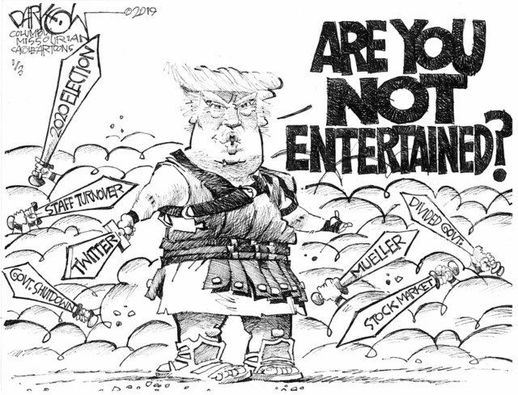
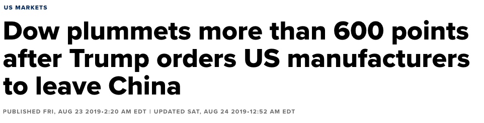
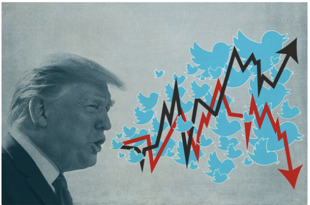

---
title: Intro 
layout: default
filename: intro.md
--- 

#### Introduction: 

 
 
 (image source: https://www.pinterest.com/pin/765049055427783076/)

No American President before Trump has weilded so instantaneous and direct a line of communication to the American public.

 
 
 (image source: https://www.cnbc.com/2019/08/23/us-stocks-wall-street-monitors-speech-from-fed-chair-jerome-powell.html)

On August 22nd 2019, China anounced retaliatory tariffs against the United States. Then at 9:59 the President tweeted saying in part "Our great American companies are hereby ordered to immediately looking for an alternative to China". According to CNBC, shortly thereafter "the Dow Jones Industrial Average fell more than 435 points, or 1.6%, while the S&P 500 slid 1.7% and the Nasdaq Composite dove 2%."

Earlier in the year, on June 18th 2019, Trump tweeted "Had a very good telephone conversation with President Xi of China. We will be having an extended meeting next week at the G-20 in Japan" and the stock market shortly thereafter "the Dow Jones Industrial Average DJIA,  1.4% the S&P 500 index (SPX) climbed 1.3%, while the Nasdaq Composite Index COMP advanced 1.8%.

https://www.cnbc.com/2019/08/23/trump-says-hes-ordering-american-companies-to-immediately-start-looking-for-an-alternative-to-china.html

https://www.marketwatch.com/story/dow-surges-350-points-as-trump-tweets-of-extended-meeting-with-president-xi-on-trade-2019-06-18

Indisputably the President's online words, have the power to affect markets. In this project, we seek to understand how the President's tweets might affect markets. Specifically we attempted to train nueral nets on sentiment analysis associated tweet keywords to predict log-adjusted stock and bond prices. 

Our ability to design models to address this problem difficult problem is chalenging because Trump's tweets tend to affect the market instantaneously, while we only have access to inter-day prices. However, our method did have limited success and more importantly, the methods herein contained could easily be imporoved upon and more powerful results obtained.

 
 
 (image source: https://www.pinterest.com/pin/765049055427783076/)

https://www.barrons.com/articles/donald-trump-twitter-stock-market-51567803655

