---
title: Models 
layout: default
filename: models.md
--- 

##### Initial Model Architecture:

Attempts to fit simple tree-based models (e.g. Random Forest) to stock and bond data were ineffective. Therefore, we explored neural networks as an alternative approach to prediction. 

An initial hit (for modelling combined American stock volatility) was found using a 3-layer dense neural network, 
with 32 `relu` nodes per layer and a single linear output node (using the `adam` optimizer in TensorFlow to optimize mean absolute error). 
A 30% dropout rate and hybrid L1/L2 regularization were found to attenuate overfitting to the training set; 
additionally, early stopping was found to be beneficial. 

Batch normalization was investigated but found to be ineffective. 

After 200 epochs of training, the neural network was found to consistently outperform a *y*-randomized control (by 7%).  

**Figure 1**: Initial Predictions for Test Set and Training Set

**Figure 2**: Model Performance By Epoch

Permutation importance analysis of the initial model (using `eli5`) revealed that the most important tweets were those referring to the Ukraine/impeachment scandal. 

{:height="350px"}

**Figure 3**: Most Important Predictors For Initial Model

##### Systematic Extension of Initial Model Architecture

To more systematically probe the importance of various features and hyperparameters, full factorial optimization in predictor and hyperparameter space was carried out using the Cannon cluster. 

###### Predictors:

The models discussed below have been trained on individual or combinations of the predictors described in the "data" section, which include: 
- Tweet metadata
- Top mentioned users
- Word2vec embeddings
- Topic scores 
- Sentiment

Predictors were combined by day, and each day's data was supplemented with the previous *n* days' data, where *n*, the 'lookback', was a hyperparameter of the model. 
The resultant dataset was standardized and divided into a train dataset (first *x* days) and a test dataset (last 208 days). 
In order to mitigate some of the overfitting that might be caused by a small training dataset, 
we augmented the training datset through addition of noise to create a dataset *k*-fold larger than the original dataset (where *k* was 50, 100, or 500--see analysis section). 

###### Responses:

Several different types of response data were modeled with these predictors: (1) Stock Market, (2) Bonds, (3) Gold, (4) Cryptocurrencies and Exchange Rates. These will each be addressed in turn. First, we will show the performance of each predictor dataset on each response set, and second in this and the analysis section on Chinese stocks and Gold, we will further investigate combinations of predictor sets in predicting these particular response variables.

###### Architecture & Training:

The model architecture is a multi-layer dense neural network with *l* layers and *n* nodes per layer, and a single output node. 
Nodes in the densely connected layer had a `relu` activation function and the output node had a linear activation function, 
as we were predominantly performing a regression task (note a few of the initial predictor-response sets were also used to train classification models of stock prices simply going "up" or "down"). After the initial models were trained, these hyperparameters were systematically varied and performance was measured (see below). 

The models were optimized using the `adam` optimizer. To avoid overfitting, dropout was performed on the input as well as on each densely connected layer. 
The percent dropout at each layer was another hyperparameter that was systematically tested in the range of 0.0--0.7.

##### Model performance on single predictor datasets

###### American Stocks:

Individual predictor sets were fit on aggregated stock market data from the United States or from China. Performance on the American stocks, both classification and regression, was generally poor for all predictor sets (Figure 1).

**Figure 4** Effect of Different Predictor Sets on Modelling American Stock Volatility

###### Chinese Stocks:

However, performance on Chinese stocks was better, and depended on the predictor set. In general, for both classification and for regression, the users either retweeted or mentioned in Trump's tweets were predictive of Chinese stock market volatility (Figure 5). 

**Figure 5** Effect of Different Predictor Sets on Modelling Chinese Stock Volatility

To validate the significance of this models, a top-performing model was refit 500 times and compared with *y*-randomized controls (Figure 6). 
The mean improvement over random was 18.6%, and the high *t*-statistic of -22.51 (*p* < 1e-90) demonstrates that the model performs significantly better than random. 

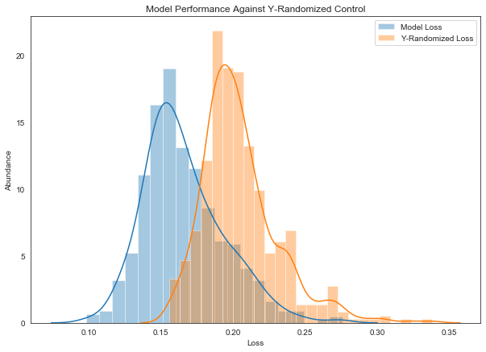

**Figure 6**: Frequent Handles Dataset Enables Modelling of Chinese Stock Volatility

###### Thirty-Year Treasury Bonds:

Modelling of bond volatility was found to be largely ineffective: although various outliers gave noticeable improvements over *y*-randomized models, 
the overall distribution of model performance implied that this was merely an artifact (Figure 7). 
Accordingly, these models were not investigated further.

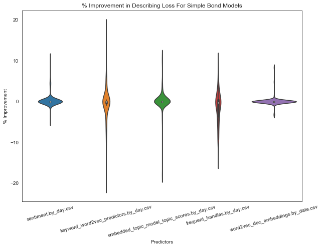

**Figure 7**: Effect of Different Predictor Sets on Modelling Bond Volatility

###### Gold Prices:

In contrast, modelling volatility in gold prices was more successful: in particular `word2vec`-based predictors sets gave marked improvement over *y*-randomized models (Figure 8). 
Raising dropout coefficients was found to be important to reduce the variance of the models (which is consistent with the pseudo-ensemble effect of neural networks with high dropout) (Figure 9).

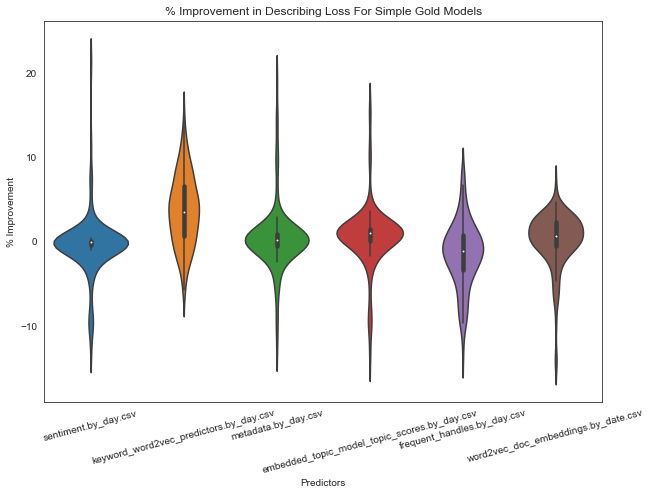

**Figure 8**: Effect of Different Predictor Sets on Modelling Gold Volatility

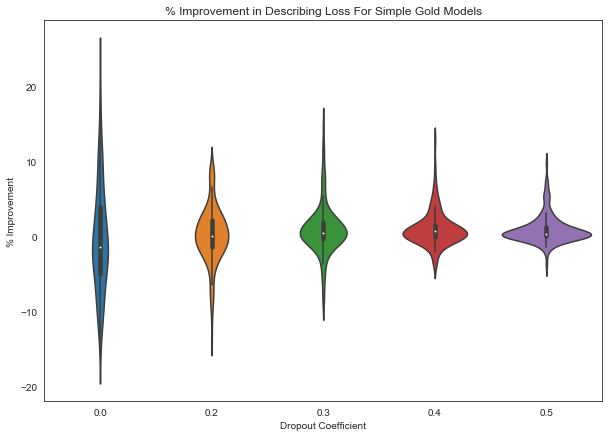

**Figure 9**: Effect of Different Dropout Coefficients on Modelling Gold Volatility

To validate the significance of these models, a top-performing model employing `word2vec` predictors was refit 500 times and compared with *y*-randomized controls: 
the model consistently outcompeted the controls, as demonstrated by a *t*-statistic of -44.19 (*p* < 1e-200) (Figure 10).
The mean improvement was 7.3%, in line with the improvement seen earlier (*vide supra*).

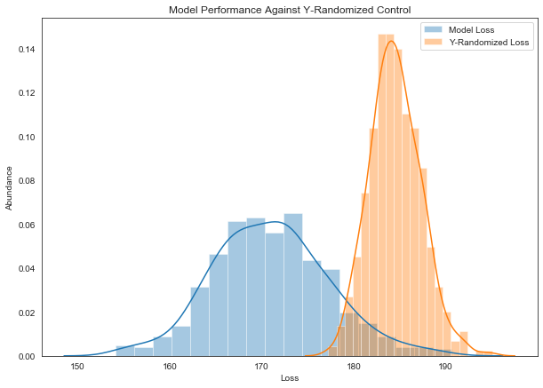

**Figure 10**: `word2vec`-based Models Consistently Perform Better Than Chance

###### Cryptocurrencies and Exchange Rates:

Modeling volatility in cryptocurrencies and in foreign exchange rates (namely, the Canadian dollar (CAD) and the Russian ruble (RUB)), on single predictor sets that had performed well in the context of other responses (namely keyword embeddings, document embeddings, and handles of people mentioned in tweets), did not yield significant improvements over random (Figure 11).

**Figure 11**: Effect of Different Predictor Sets on Modelling Cryptocurrency and Exchange Rate Volatility

#### Model optimization on multiple predictor datasets

We next asked whether nonredundant, predictive information could be extracted from multiple predictor datasets. For this analysis, we focused on the Chinese Stock Market volatility as a response variable. The top performing predictors were `word2vec` embeddings and twitter handles, so we first combined these two predictor sets. We included the appropriate lookback for the best performing models: in the case of the Chinese Stock Market, the best performing models had 5 days of lookback. We trained models with the identical architecture (3 layers, 32 nodes each) and dropout rate (0.3) as in the single predictor set models, in order to assess the effects of the increased number of predictors on this architecture. 

Notably, the test loss increased signficantly, and the percent improvement over random decreased. This is illustrated in Table 1, which compares the model performance between the single predictor and the combined predictors, using an identical architecture to the single predictor. 
This table suggests that the model with more predictors was overfit to the dataset, because the training set loss diverges from the test set loss.
Overfitting would be expected from this increase in predictors, because the number of parameters (weights) in the model increases, but the number of training examples stays the same. This effect did not appear to be rescued through augmenting the dataset with more synthetic datapoints (although it is possible that different augmentation strategies could be employed in the future, see Future Directions).

| Predictors         | Augmentation n | % Improvement | Test Loss | Training Loss | Validation Loss |
|--------------------|----------------|---------------|-----------|---------------|-----------------|
| Word2Vec           | 50             | 17.1          | 0.386     | 0.352         | 0.234           |
| Handles            | 50             | 39.2          | 0.263     | 0.315         | 0.276           |
|--------------------|----------------|---------------|-----------|---------------|-----------------|
| Word2Vec + Handles | 50             | 10.39         | 0.681     | 0.059         | 0.014           |
| Word2Vec + Handles | 100            | 3.77          | 0.599     | 0.058         | 0.011           |
| Word2Vec + Handles | 500            | 8.73          | 0.551     | 0.058         | 0.013           |

**Table 1**: Effect of Additional Predictor Sets and Data Augmentation on Modelling Chinese stocks

We next explored whether changes in model architecture or dropout could prevent overfitting, while taking advantage of the added information of more predictors. We systematically varied model architecture parameters of number of layers and number of nodes per layer. Figure 12 shows visually the test set loss vs the training set loss, colored by particular hyperparameters. The losses are anticorrelated, which represents a bias-variance tradeoff; this is best seen in the far left plot, which looks at different amounts of dropout. Low dropout results in an overfit model with poor test set performance, whereas higher dropout can improve generalization (although dropout that is too high effectively handicaps the model and worsens training and test set performance). The plot on the right showing the total number of nodes (nodes per layer * number of layers) does not show a strong correlation of a particular number of nodes with a particular test or training set performance. 

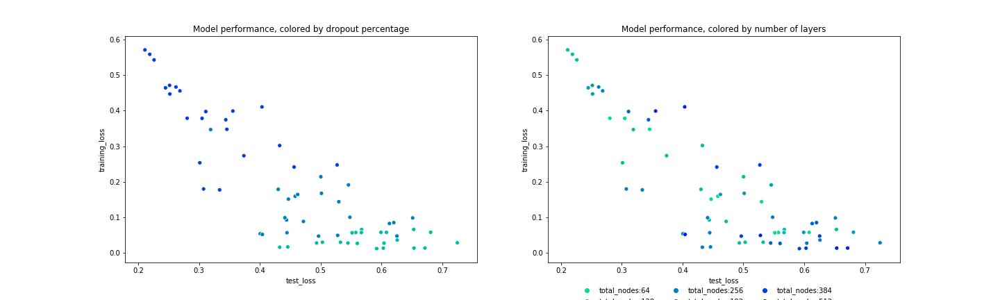

**Figure 12**: Many 'lookback' predictors cause model overfitting

Given that these modifications of the architecture did not appear to substantially improve prediction, we hypothesized that decreasing the number of lookbacks for particularly large predictor sets would reduce the number of trainable parameters, therefore mitigating some of the overfitting. We chose to shrink the `word2vec` embeddings predictors (300 predictors total) to include only those from the current day (though in the future, we would systematically individually tune lookbacks for every predictor set). We trained multiple models, varying the number of layers [2, 3, or 4], and the number of nodes per layer [32, 64, 12]. The dataset augmentation was 250-fold and dropout was 0.6. We observed the percent improvement of the model over random as a function of the number of trainable parameters in the model, and unsurprisingly found that fewer parameters in the model caused a significant increase in performance, as measured by percent improvement (Figure 13).

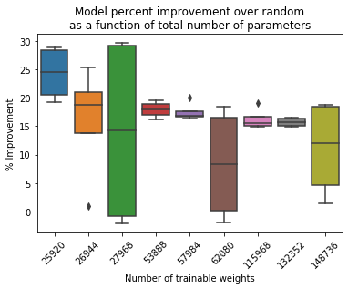

**Figure 13**: Reducing number of model parameters results in improved model performance

We next chose the best performing model: 4 layers with 32 nodes, and varied the dropout during training from 0.0 to 0.7. Over 11 independent training runs of each dropout, it is evident that increasing dropout in general helpful in both increasing Percent Improvement over random as well as the test loss (Figure 14). However, there is very high variability in model performance at dropout of 0.4 and 0.5. 

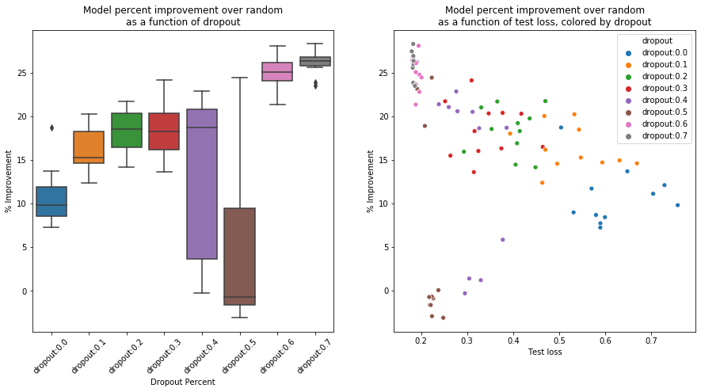

**Figure 14**: Low dropout improves model performance on both the training and test sets

To further investigate this variability, we looked at the training runs and test set predictions for exemplar models with varied dropout (Figure 15). At low levels of dropout, the model overfits somewhat to the training set; as low as 20% dropout, the test set performance improves over training set performance. However, at 50% dropout, the model is completely unstable, with most predictions a flat line at 0.25 daily delta. At higher dropout, the performance on the training set again decreases, but the test set predictions recover. 

| Dropout | Model Performance: (l) Training run loss (r) Test set actual vs predicted |
|---------|---------------------------------------------------------------------------|
| 0.1     |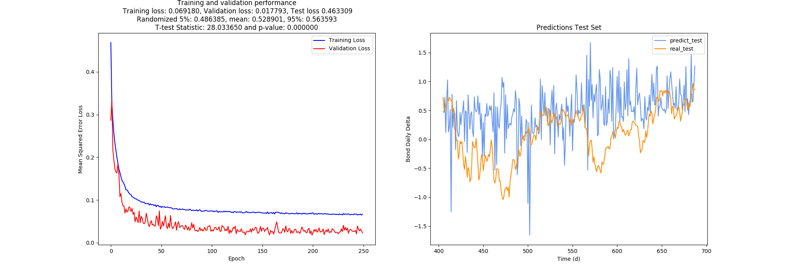{:width="1200px"}|
| 0.2     |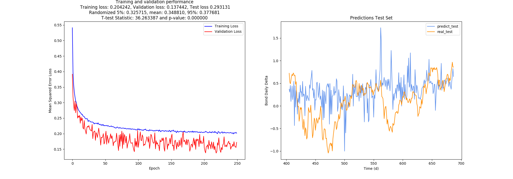{:width="1200px"}|
| 0.5     |{:width="1200px"}|
| 0.6     |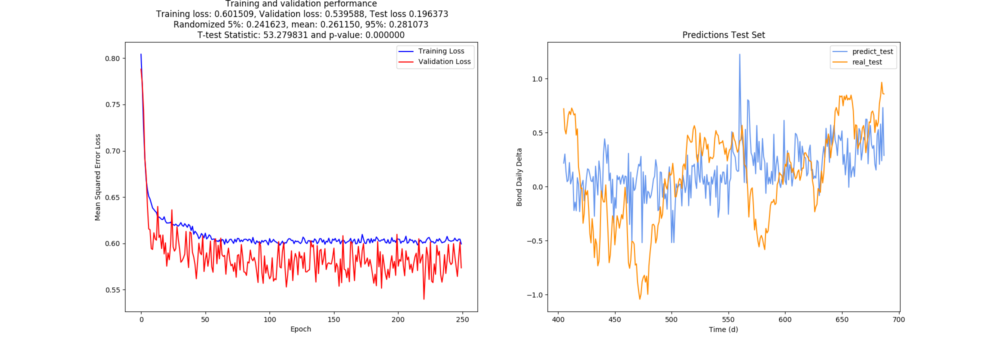{:width="1200px"}|

**Figure 15**: Mid-level dropout causes model instability

Overall, the 'optimal' model for this dataset is one in which validation set performance is predictive of test set performance. However, in these models, we observed that validation set performance tended to track more closely with the training set performance. This might suggest that, due to the addition of 'lookback' predictors or to the data augmentation, the validation set is allowed to 'peak' at the training set, and therefore perform better than it should. Further investigation should be undertaken to investigate the effects of lookback predictors and data augmentation on validation performance in particular.

